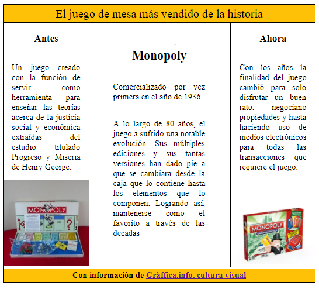

# Ejercicio N°4: EL TRÍPTICO
Réplica de la siguiente imagen usando float.

____
Para este ejercicio creamos las siguientes carpetas y archivos:

1. assets
    * images.png
2. css
    * main.css
3. index.html
4. README.md
____

## Archivo HTML
Una vez creado, empezamos escribiendo el formto HTML en archivo index.html y lo primero que hicimos fue crear 4 divs :

    * "title"
    * "second-column"
    * "third-column"
    * "base"
    
Y linkeamos en el primer y tercer "div" las imagenes guardadas en la carpeta "assets".

## Archivo CSS
En el archivo main.css le dí formato y estilo a cada una de los divs como: color, posición, altura y anchura, para ir creando el triptico de Monopoly.

## Assets
En esta carpeta van las imagenes que utilizamos para darle estilo a nuestro triptico y la imagen para colocarla en nuestro archivo README.md.

____

    Trabajo realizado por el Squad "Women@Design" :)
